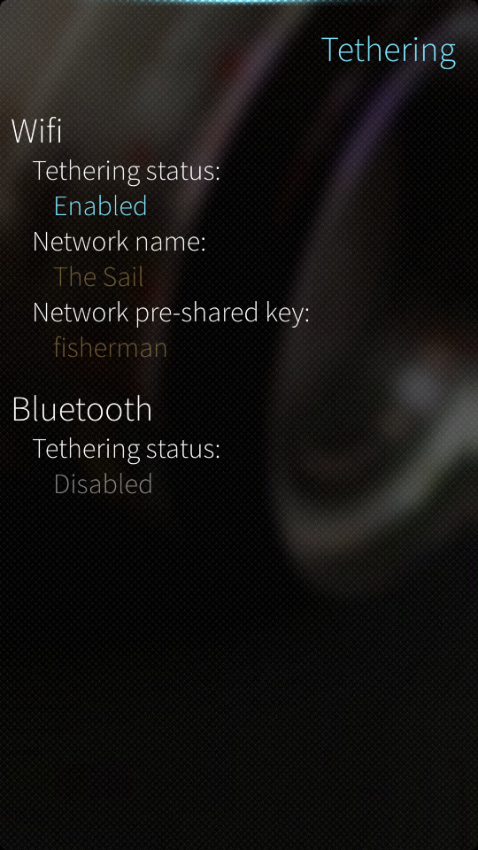

=========
Tethering
=========

A tethering GUI for the Jolla phone (SailfishOS). It supports Bluetooth and
Wifi (WPA2) tethering by controlling ConnMan directly via D-BUS. The GUI will
automatically create a packet data connection and power on the necessary
interface(s), when enabling tethering. It will also restore the states of
the interfaces, when a user disables tethering.
.. _jolla: http://jolla.com
.. _sailfishos: http://sailfishos.org
.. _connman: http://connman.net

At the moment only basic information is shown in the GUI. This is somewhat
due to the fact that ConnMan doesn't (yet) provide detailed information about
tethering. The same applies to the configurable parameters as ConnMan only
allows for configuring the SSID and PSK of the Wifi network. For example the
private network address is randomized every time and cannot be explicitly
configured.

Installable RPM packages can be downloaded from the pkg directory.

License
=======

Everything is released under the terms of BSD-new.

Screenshots
===========

Known Issues/Notes
==================

* In some cases the enabling process might end up into an error and a user
  will need to try again or restart the app and try again.

* Any feedback and/or contributions are always welcome

Releases
========

* Features:
    * Wifi tethering
    * Bluetooth tethering
    * Automatic connection handling
    * Restoring states of the interfaces

* Status:
    * ``"Beta"`` -- Works well, but needs more testing

* Changelog:
    * ``v0.2.4``
        * first release

